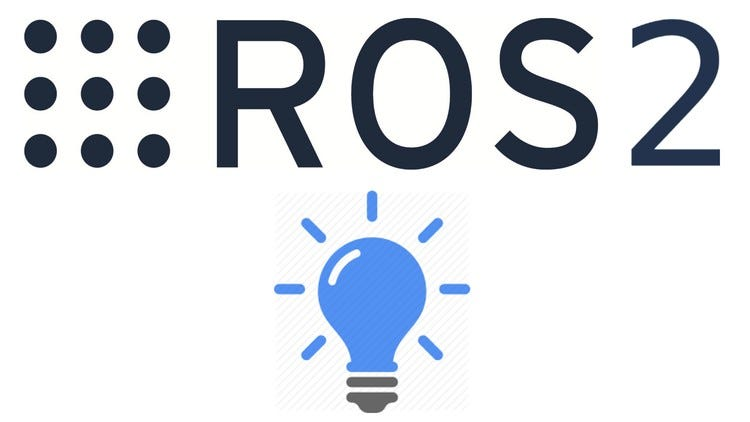

<h1 align="center">
  
</h1>

  <strong>Hi, I'm Wu Siyu</strong>, a <strong>SLAM Algorithm Engineer</strong> from Wuhan, China, passionate about <strong>robotics and autonomous driving</strong>.
    
  🔬 <strong>Currently engaged in robot mapping and localization research</strong> 
  🎓 <strong>Graduated from China Three Gorges University</strong> with a major in <strong>Mechanical Design</strong> and a minor in <strong>Computer Science and Technology</strong> 
  🎓 <strong>Experienced in developing robotic systems and deploying SLAM algorithms on low-computing-power devices</strong> 
  🎓 <strong>Passionate about coding and solving complex real-world problems through technology</strong> 
  💻 <strong>Currently exploring how to commercialize SLAM solutions and apply them in real-world business scenarios</strong> 
  📚 <strong>Open to discussions about robotics, SLAM applications, and tech entrepreneurship</strong> 
  💬 <strong>Ask me anything</strong> from <a href="git@github.com:CTGUMARK/CTGUMARK.git/issues" title="Issues"><strong>Here</strong></a> 
  📫 <strong>How to reach me:</strong> <a href="mailto:18385097614@163.com"><strong>18385097614@163.com</strong></a>

<h2 align="center">🔥 Languages & Frameworks & Tools & Abilities 🔥</h2>
 

  <code></code>
  <code></code>
  <code></code>
  <code></code>
  <code></code>
  <code></code>
  <code></code>
  <code></code>
  <code></code>

  <picture>
    <source media="(prefers-color-scheme: dark)" srcset="https://raw.githubusercontent.com/Peter-JXL/Peter-JXL/output/github-contribution-grid-snake-dark.svg">
    <source media="(prefers-color-scheme: light)" srcset="https://raw.githubusercontent.com/Peter-JXL/Peter-JXL/output/github-contribution-grid-snake.svg">
    
  </picture>

